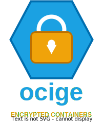

<p align="center">
  
</p>


# Ocige

*Ocige* (_O-CIGE_) is a tool for exchanging files via a container registry. It utilizes Age encryption to secure files and leverages container registries for storage. To support large files, the content is split into chunks and packed as individual layers within the container image.
For key exchange, exclusively quantum-secure algorithms are used.
Designed as a CLI tool, it is distributed as a single binary with no external dependencies.

## Core Concept
Think of Ocige as a form of "secure file sharing" built upon container registry infrastructure. Instead of sharing files directly, they are packaged into a container image and stored in the registry. The recipient can then download and decrypt the file.
Since it uses Age, multiple recipients can receive the files by exchanging their public keys.

## Usage

*Ocige* uses a "Vault" concept. Each artifact in the registry is its own encrypted vault, locked by a unique **Vault Identity**. You then share this identity's secret key with specific recipients by encrypting it for their public keys.

### 1. Key Generation
To use Ocige, you need a PQ-safe key pair.

```bash
# Generate a new key pair and save to a file
ocige keygen -o mykey.txt
```

*   `mykey.txt` contains your **Secret Identity**. Keep this private.
*   The output file also contains your **Public Key** (starting with `age1pq1...`) in a comment. Share this with others so they can send you files.
*   This is compatible with standard PQ-safe Age recipients and identities (https://age-encryption.org/).

### 2. Pushing Files (Creating a Vault)
To upload files, you need the public keys of all intended recipients.

```bash
# Create a recipients file (one public key per line)
echo "age1pq1..." > recipients.txt

# Push files/folders to a registry
ocige push --recipients recipients.txt ghcr.io/user/my-vault:v1 file.pdf data/
```

### 3. Listing Contents
You can view the file structure of a vault without downloading all payload layers.

```bash
ocige ls --identity mykey.txt ghcr.io/user/my-vault:v1
```

### 4. Pulling Files
Decrypt and download the contents to a local directory.

```bash
# Pull everything
ocige pull --identity mykey.txt --output ./extracted ghcr.io/user/my-vault:v1

# Pull only specific files
ocige pull --identity mykey.txt --output ./extracted ghcr.io/user/my-vault:v1 file.pdf
```

### 5. Managing Vaults (Append & Remove)
Ocige allows you to add or remove files from an existing artifact without re-uploading every file.

```bash
# Add a new file to the existing vault
ocige append --identity mykey.txt ghcr.io/user/my-vault:v1 extra.txt

# Remove a file from the vault
ocige remove --identity mykey.txt ghcr.io/user/my-vault:v1 file.pdf
```

### 6. Rotating Access (Rekeying)
If you want to add or revoke access for certain recipients, you can rotate the vault encryption for a new recipients list without touching the data layers.

```bash
# Update the vault to a new list of recipients
ocige rekey --identity mykey.txt ghcr.io/user/my-vault:v1 new_recipients.txt
```

### Environment Variables
For convenience, you can set environment variables to avoid passing flags repeatedly.

| Variable | Flag | Description |
| :--- | :--- | :--- |
| `OCIGE_IDENTITY` | `--identity`, `-i` | Path to your secret identity file (used for decryption/listing). |
| `OCIGE_RECIPIENTS` | `--recipients`, `-R` | Path to the public recipients file (used for initial push). |
| `DOCKER_CONFIG` | `--docker-config` | Path to Docker `config.json` for registry authentication. |

---

## CLI Reference

```bash
❯ ocige
NAME:
   ocige - Secure File Sharing over OCI Registries

USAGE:
   ocige [global options] [command [command options]]

COMMANDS:
   push     Pushes files to registry target
   pull     Pulls files from registry target
   ls       Lists files in the target
   append   Adds files to an existing artifact
   rekey    Rotates the Vault Identity for a new recipients file
   remove   Removes files from an artifact
   keygen   Generates a new PQ-safe key pair
   help, h  Shows a list of commands or help for one command

GLOBAL OPTIONS:
   --insecure              Use plain HTTP for registry
   --docker-config string  Path to docker config.json [$DOCKER_CONFIG]
   --help, -h              show help
```