# FUSE Mount Command for Ocige

A read-only FUSE mount that provides an encrypted OCI artifact as a local filesystem – similar to `rclone mount`. Files are decrypted **on-demand** and are **seekable**, without needing to download them completely.

## Background & Core Concept

Ocige stores files as encrypted, chunked OCI layers. The Index contains the directory structure and chunk mappings. With `ocige mount`, the Index is decrypted and provided as a FUSE filesystem. When reading a file, only the **actually required OCI chunks** are loaded on-demand from the registry.

### Why it works: Age STREAM + `DecryptReaderAt`

Age uses the **STREAM** construction (ChaCha20-Poly1305 in **64 KiB Chunks** with counter-based nonces). This design is **seekable by design** – you can decrypt any 64 KiB block independently if you know the payload key.

`filippo.io/age@v1.3.1` (our version) provides:
```go
func DecryptReaderAt(src io.ReaderAt, encryptedSize int64, identities ...Identity) (io.ReaderAt, int64, error)
```

This function returns a **seekable, thread-safe** `io.ReaderAt`. Internally, it only decrypts the 64 KiB Age block that contains the requested offset.

### How Ocige uses it: Lazy-Fetch OCIReaderAt

The entire Age ciphertext of a file is distributed across N OCI chunks in the registry. We build a virtual `io.ReaderAt` over it that fetches OCI chunks **lazy on-demand**:

```
Layout of the virtual ciphertext stream:

  Offset:    0        200B        100MB+200      200MB+200     300MB+200
             ├─Header─┤──OCI-Chunk 0──┤──OCI-Chunk 1──┤──OCI-Chunk 2──┤...
             │ (in-mem)│   (lazy fetch) │   (lazy fetch) │   (lazy fetch) │
             └─────────┴───────────────┴───────────────┴───────────────┘
                       ↑
                  DecryptReaderAt reads here via ReadAt()
                  → only that specific OCI chunk is fetched
```

**No push format change needed.** No additional metadata. The existing `FileEntry.Chunks` with `layer_digest`, `size_encrypted`, and `order` are sufficient for offset mapping.

## User Review Required

> [!IMPORTANT]
> **Dependency `hanwen/go-fuse/v2`**: Actively maintained FUSE library for Go (used by gocryptfs). Requires `libfuse-dev` on the host. Is this acceptable? (User: Yes)

> [!WARNING]
> **Linux-only** as the initial scope. macOS (macFUSE) support can be added later via build tags.

## Architecture Overview

```mermaid
graph TD
    A["ocige mount target mountpoint"] -->|1. Unlock Vault| B[BaseClient.FetchIndex]
    B -->|2. Decrypt Index| C[Index with FileEntries]
    C -->|3. Build Virtual FS| D[FUSE VirtualRoot]
    D --> E[VirtualDir Nodes]
    D --> F[VirtualFile Nodes]
    F -->|4. Open: Build OCIReaderAt| G[OCIReaderAt]
    G -->|5. Lazy Fetch individual chunks| H[OCI Registry]
    G -->|6. Cache encrypted chunks| I[DiskCache]
    G -->|7. DecryptReaderAt| J["age.DecryptReaderAt → seekable io.ReaderAt"]
    J -->|8. Read: ReadAt offset| F
    
    style D fill:#2d5016,stroke:#4ade80
    style G fill:#1e3a5f,stroke:#60a5fa
    style J fill:#4a1d6e,stroke:#c084fc
    style I fill:#5c2d0e,stroke:#fb923c
```



### Core Components

| Component | Task |
|:---|:---|
| `OCIReaderAt` | Virtual `io.ReaderAt` over Age header + N OCI chunks. Lazy-fetch per chunk. |
| `DiskCache` | LRU cache for **encrypted** OCI chunk blobs on disk. |
| `ChunkFetcher` | Orchestrates registry fetch + cache + builds `OCIReaderAt` + `DecryptReaderAt`. |
| `VirtualFS` | FUSE nodes (Root, Dir, File) based on the decrypted Index. |
| `MountServer` | Mount lifecycle, signal handling, unmount. |

## Proposed Changes

### New Dependencies

#### go.mod
```
github.com/hanwen/go-fuse/v2  (FUSE filesystem library)
```

---

### Component 1: OCIReaderAt (Core Abstraction)

#### [NEW] [oci_reader_at.go](file:///home/coder/dev/ocige/pkg/fusefs/oci_reader_at.go)

Virtual `io.ReaderAt` over the concatenated ciphertext: `[Age-Header] [OCI-Chunk₀] [OCI-Chunk₁] ...`

Supports two modes:
- **Synchronous** (`NewOCIReaderAt`): All chunk paths are already known.
- **Async** (`NewOCIReaderAtAsync`): Chunks are resolved via `chunkSlot` futures. `ReadAt()` blocks transparently until the required chunk is available.

The `ReadAt()` path also includes **prefetch logic**: if a read falls within the last 25% of an OCI chunk, the next chunk is preloaded asynchronously.

```go
package fusefs

// OCIReaderAt implements io.ReaderAt over an Age header (in memory)
// followed by N encrypted OCI chunk files (on disk, resolved via chunkSlots).
type OCIReaderAt struct {
    header    []byte
    headerLen int64
    slots     []*chunkSlot  // Chunk futures, in order
    total     int64         // Total size (header + all chunks)
    prefetcher func(chunkIdx int)  // Callback to preload next chunk
}

// NewOCIReaderAtAsync builds the virtual stream with pending chunk slots.
// Total size is calculated from header length + sum of expected chunk sizes.
func NewOCIReaderAtAsync(header []byte, slots []*chunkSlot) *OCIReaderAt

func (r *OCIReaderAt) Size() int64 { return r.total }

func (r *OCIReaderAt) ReadAt(p []byte, off int64) (int, error) {
    if off >= r.total {
        return 0, io.EOF
    }

    totalRead := 0
    remaining := int64(len(p))

    // Phase 1: Read from header if necessary
    if off < r.headerLen {
        n := copy(p, r.header[off:])
        totalRead += n
        off += int64(n)
        remaining -= int64(n)
        if remaining == 0 {
            return totalRead, nil
        }
    }

    // Phase 2: Read from OCI chunks
    // Calculate which chunk is affected
    payloadOff := off - r.headerLen
    for remaining > 0 && off < r.total {
        chunkIdx, localOff := r.resolveOffset(payloadOff)
        
        // Wait until chunk is available (blocks on pending fetch)
        path, chunkSize, err := r.slots[chunkIdx].wait()
        if err != nil {
            return totalRead, err
        }
        
        // PREFETCH: If we are in the last 25% of the chunk,
        // preload the next chunk asynchronously
        if localOff > chunkSize*3/4 && chunkIdx+1 < len(r.slots) {
            // Prefetch is non-blocking, returns immediately
            if r.prefetcher != nil {
                r.prefetcher(chunkIdx + 1)
            }
        }
        
        // Read from cache file
        toRead := min(remaining, chunkSize-localOff)
        f, err := os.Open(path)
        if err != nil {
            return totalRead, err
        }
        n, err := f.ReadAt(p[totalRead:totalRead+int(toRead)], localOff)
        f.Close()
        
        totalRead += n
        off += int64(n)
        payloadOff += int64(n)
        remaining -= int64(n)
        
        if err != nil && err != io.EOF {
            return totalRead, err
        }
    }

    if totalRead == 0 {
        return 0, io.EOF
    }
    return totalRead, nil
}

// resolveOffset calculates chunk index and local offset from payload offset.
func (r *OCIReaderAt) resolveOffset(payloadOff int64) (chunkIdx int, localOff int64)
```

> [!NOTE]
> **Prefetch strategy:** If a `ReadAt()` falls within the last ~25% of an OCI chunk (sequential reading), the next chunk is requested asynchronously. This is a hint to the `ChunkFetcher` – if the chunk is already in the cache, it's a no-op.

---

### Component 2: Disk Cache

#### [NEW] [cache.go](file:///home/coder/dev/ocige/pkg/fusefs/cache.go)

LRU disk cache for **encrypted** OCI chunk blobs. Decryption happens later via `DecryptReaderAt`.

**Important: The cache is global and content-addressed (per chunk digest), not per manifest.** Thus, chunks can be reused across different mounts – a new mount of the same artifact or one with shared layers will find cached chunks immediately.

```go
package fusefs

// DiskCache stores encrypted OCI chunks as files on disk.
// The cache is global and content-addressed: filename = chunk digest.
// Different mounts share the same cache automatically.
type DiskCache struct {
    dir     string           // e.g., ~/.cache/ocige/chunks/
    maxSize int64            // Max total size in bytes (default: 1 GB)
    mu      sync.Mutex
    entries map[string]*cacheEntry
    current int64            // Current total size
}

type cacheEntry struct {
    path       string    // Path to cache file
    size       int64
    lastAccess time.Time
}

// NewDiskCache opens or creates the cache in the specified directory.
// On start, it scans the directory to find existing cache entries from previous mounts.
func NewDiskCache(dir string, maxSize int64) (*DiskCache, error)

// GetPath returns the path to a cached chunk if present.
func (c *DiskCache) GetPath(digest string) (string, bool)

// Put saves data under the given digest and returns the path.
// Evicts oldest entries if necessary.
func (c *DiskCache) Put(digest string, data []byte) (string, error)

// GetOrFetch: Atomic cache-or-fetch. Thread-safe.
// If the digest is not cached, fetchFn is called.
func (c *DiskCache) GetOrFetch(digest string, fetchFn func() ([]byte, error)) (string, error)

// evict removes oldest entries until current < maxSize.
func (c *DiskCache) evict()

// Close is a no-op – the cache remains on disk for later mounts.
func (c *DiskCache) Close() error
```

---

### Component 3: Chunk Fetcher

#### [NEW] [fetcher.go](file:///home/coder/dev/ocige/pkg/fusefs/fetcher.go)

Orchestrates: Registry Fetch → DiskCache → OCIReaderAt → `age.DecryptReaderAt`.

```go
package fusefs

// ChunkFetcher downloads OCI chunks and builds seekable plaintext readers.
type ChunkFetcher struct {
    client        *ociregistry.BaseClient
    vaultIdentity age.Identity
    cache         *DiskCache
    sem           chan struct{} // Concurrency limiter for registry access
}

func (f *ChunkFetcher) OpenFile(ctx context.Context, entry ociregistry.FileEntry) (*FileReaderAt, error) {
    // ... logic for async fetching and building OCIReaderAtAsync ...
}
```

> [!NOTE]
> **Non-blocking Open():** `OpenFile` starts chunk fetching in the background and returns once `DecryptReaderAt` has validated the header + last chunk. Reads on chunks not yet loaded block transparently in `chunkSlot.wait()`.

---

### Component 4: FUSE Virtual Filesystem

#### [NEW] [virtualfs.go](file:///home/coder/dev/ocige/pkg/fusefs/virtualfs.go)

Implements the read-only FUSE filesystem based on `go-fuse/v2/fs`.

---

### Component 5: Mount Server & Lifecycle

#### [NEW] [mount.go](file:///home/coder/dev/ocige/pkg/fusefs/mount.go)

---

### Component 6: CLI Integration

#### [MODIFY] [main.go](file:///home/coder/dev/ocige/cmd/ocige/main.go)
Add `mount` command.

#### [MODIFY] [handlers.go](file:///home/coder/dev/ocige/cmd/ocige/handlers.go)
Add `handleMount` handler.

#### [MODIFY] [helpers.go](file:///home/coder/dev/ocige/cmd/ocige/helpers.go)
Add `defaultCacheDir`.

---

## Decisions (from User Review)

| Question | Decision |
|:---|:---|
| Eager vs. Lazy Fetch | **Eager-on-Open**: All chunks started in parallel at `Open()`, but `Open()` doesn't block until all are done. |
| Prefetch | **Yes**: Preload next chunk when a read hits the last 25% of the current chunk. |
| `umount` Subcommand | **No**: `fusermount -u` or `Ctrl+C` is sufficient. |
| Cache Isolation | **Global content-addressed**: Reusable across mounts. |
| Cache Cleanup | **`ocige cache prune`** (future command, cache structure prepared). |

## Verification Plan

### Unit Tests
`go test ./pkg/fusefs/...`

### E2E Test
`go test ./test/e2e/ -run TestMount`
- Auto-skip if `/dev/fuse` is missing.
- Push test data, mount, verify file content (full and partial reads), verify read-only.
